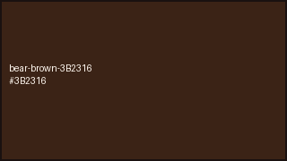
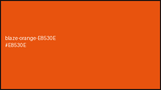
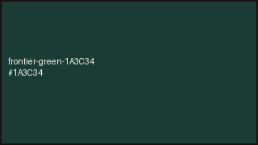
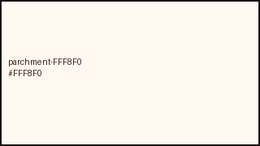
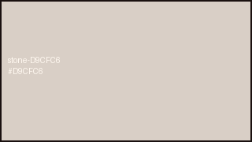
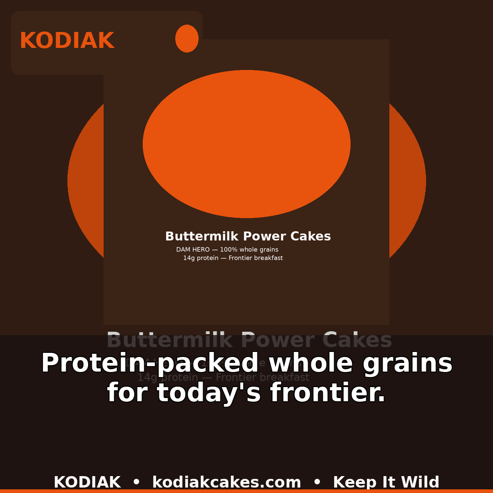
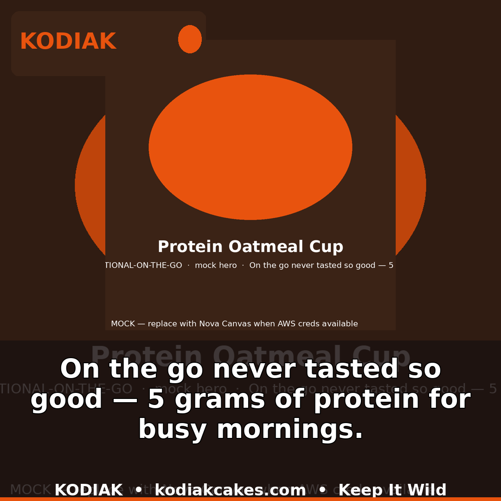
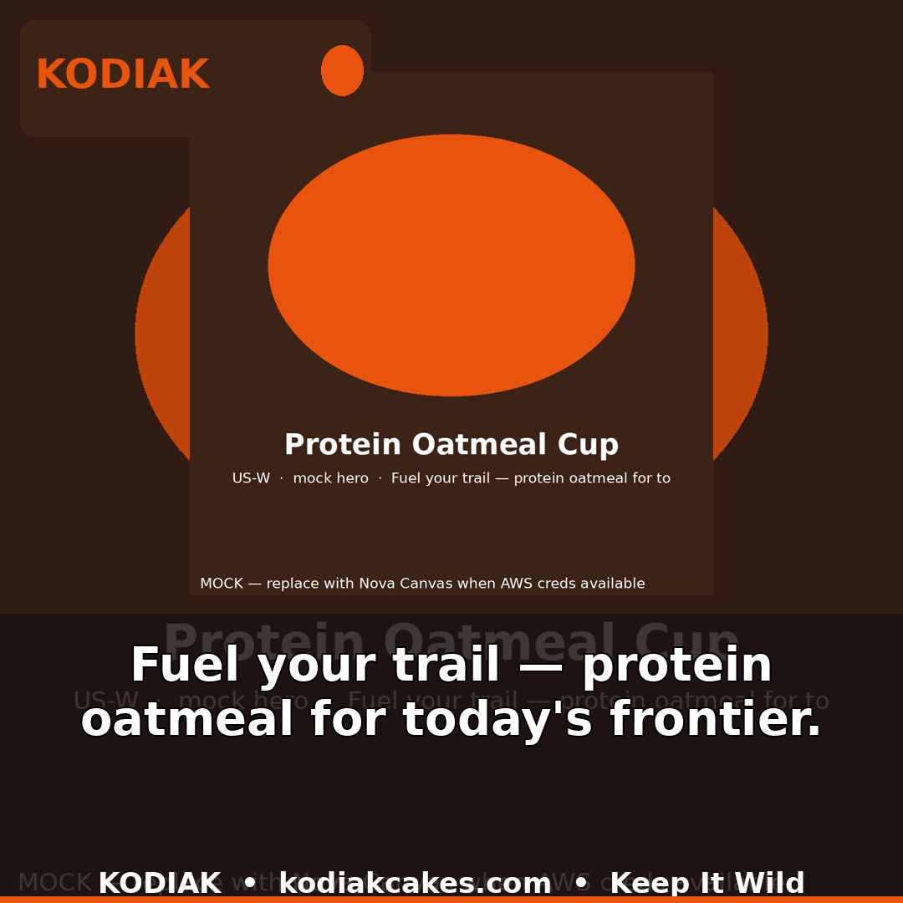

# Kodiak — Real Food for Real Adventures. Built for the Frontier.

> A custom creative system for Kodiak Cakes. One brand, one photo library, one idea sheet — and hundreds of local ads that still look like Kodiak whether they run at a Walmart in Alamogordo, a Target in Las Cruces, or the diner on Route 70 that flips griddle cakes on Saturday.

**This is not a generic social pipeline.** Every line, every photo cue, every color in here comes from Kodiak — the red wagon in 1982, the Wasatch Mountains, 14 grams of protein, Keep It Wild with Vital Ground. The system exists so Maya in Park City can write one line and Diego in the Southwest can share it that afternoon without waiting on an agency.

View the brand the way marketing sees it: [Human story](docs/kodiak-brand-explained.md) · [Visual page](docs/kodiak-brand-view.html) · [Who runs this](docs/ux-persona-kodiak.md) · [Every town](docs/regional-cultural-database.md) · [AgentCore + RAG architecture](docs/bedrock-agentcore-architecture.md)

---

## What it feels like to run a campaign for Kodiak

Maya opens a one-page idea sheet. Not a ticket. Just:

- **Where** — Las Cruces plus Alamogordo, New Mexico, or Publix country in Savannah, or the national on-the-go crowd of students and commuters
- **Who** — Green chile families 28 to 45, or Target Gen Z who reads the ingredient list, or the diner regulars who ask for the Bear Bites side
- **One line** — "Green chile meets grizzly — protein for your Las Cruces frontier" or "On the go never tasted so good — 5 grams for busy mornings"

She presses run. In ten minutes she has three finished ads for every product — square for the feed, tall for stories, wide for the menu board — each with the bear at 24,24, the warm orange 8-point bar at the bottom, and her line centered over the soft dark band. Green pass badges mean the bear is present and the frontier colors are right. She picks where each goes: Publix southeast, Target Midwest, Costco bulk west, that small independent in Alamogordo, or the diner. One map, one post, every town sees its own store name and its own Get Directions button.

Diego sees the Las Cruces green chile version on his phone the same morning and shares the tall story. Priya sees one master post automatically show "Find us today in {{your town}}!" to Chicago and Miami with the right map card.

That grow from one town to the next is saved — place, audience, line, photo cue — into the growing regional memory at `data/localization/` so the next Las Cruces run suggests green chile first because it already worked there.

## Try Kodiak in 30 seconds

```bash
uv run python -m creative_automation.cli --brief briefs/kodiak.yaml --assets input_assets --out /tmp/kodiak-parks
open /tmp/kodiak-parks/preview.html
```

That is Park City, Wasatch Mountains — Keep It Wild, protein-packed whole grains for today's frontier. Power Cakes reuses a real photo, Bear Bites and oatmeal cup are made new with the frontier palette.

**Then try the local flex you asked for — Las Cruces green chile:**

```bash
uv run python -m creative_automation.cli --brief briefs/kodiak-publix.yaml --assets input_assets --out /tmp/kodiak-publix
uv run python -m creative_automation.cli --brief briefs/kodiak-on-the-go.yaml --assets input_assets --out /tmp/kodiak-onthego
open /tmp/kodiak-on-the-go/preview.html
```

On-the-go replaces the old back-to-school idea — oatmeal cups and Bear Bites for students and commuters, "5 grams for busy mornings," from your mini bars and training guide. Always useful, not just August.

Every output is organized by product and size: `docs/assets/previews/kodiak-keepitwild-1x1.png` plus a report that members can read (`output_kodiak/report.json`, `report.jsonl` per creative per place) and a green pass board (`preview.html`).

Look inside the style library that makes this look like Kodiak everywhere:

<p align="center">
  
  
  
  
  
</p>
<p align="center"><em>Bear Brown #3B2316 · Blaze Orange #E8530E · Frontier Green #1A3C34 · Parchment #FFF8F0 · Stone #D9CFC6</em></p>
 colors Bear Brown #3B2316 Blaze Orange #E8530E Frontier Green #1A3C34 at `design/tokens/kodiak.json`, photo directions at `references/keep-it-wild/`, six-piece template at `references/templates/social-3ratio.json`, and all of it mirrored to cloud storage at `s3://chasko-creative-dam-946179428633-us-east-1/brands/kodiak/`.

## The campaigns we actually plan to run — all Kodiak, all local

- **Keep It Wild** — Wasatch dawn, grizzly-safe, Vital Ground co-badge. Power Cakes hero, wilderness not candy.
- **Frontier Breakfast — retailer local** — same three flapjack, bite, and cup products but tuned per store group: Publix "for your family's frontier" (porch breakfast), Target "Fuel your frontier — 14 grams, whole grains" (clean label), Costco "Stock the frontier — every morning" (bulk family). See `briefs/kodiak-publix.yaml`, `kodiak-target.yaml`, `kodiak-costco.yaml`.
- **Seasonal: trail and holiday** — Oatmeal cup on a rocky overlook at sunrise (`kodiak-trail.yaml`), cast-iron stack for holidays (`kodiak-holiday.yaml`), both with Kodiak prompts kodiak-04/05/07.
- **On the Go** — students and commuters, 5 grams of protein that travels (`kodiak-on-the-go.yaml`).
- **Diner Flip** — local diners within 5 miles of any Kodiak store that agree to flip cakes, printable table tent and menu board from the same three sizes (`kodiak-diner.yaml`).
- **Subscribe and Save home delivery** — direct channel, 15 percent off plus free shipping over 45, "real food for real adventures" (`kodiak-subscription.yaml`).
- **Small grocers and the Alamogordo–Las Cruces cluster** — Walmart and Albertsons kodiakcakes.com/store-locator already shows plus independents added by zip, all in the same phone book at `data/localization/` and the retail network table.

See the full 18-place memory with green chile at the top: `docs/regional-cultural-database.md` — from Las Cruces to Chicago to Brooklyn.

## Channels — one creative, many doors

- Big southern supermarkets, style-forward national chain, big membership stores, small independents, local diners, direct home delivery subscription, and Amazon at https://www.amazon.com/stores/page/19CF7868-DF80-4939-932A-6FD69C6E5A1E plus https://kodiakcakes.com/collections/all (inventory copied to `references/brand-inventory.json` and cloud storage).
- Training comes from your own brand ambassador guide — video, two-page vibe sheet, feedback portal (people served, samples handed) — now tied to the same regional memory.

## How it works without the short forms

- One cloud setup holds everything — described together in `infra/template.yaml` (currently live as `chasko-creative-dam-946179428633-us-east-1` in us-east-1, versioned, private, encrypted). It keeps the style library, the regional knowledge, the store list, and the logs together. Create the phone book once in Business Locations, organize store groups, turn advantage budget off so Las Cruces stays Las Cruces, make one post and reuse it with "Use Existing Post," let dynamic text `{{store.city}}` and the map card do the local swap, button to Get Directions — full plain steps at `docs/how-we-launch-in-every-town.md`.
- Style tokens live in `design/tokens/kodiak.json` and mirror to cloud. The pipeline pulls them first from cloud when `DAM_S3_BUCKET` is set, otherwise from your laptop. No hard-coded colors.
- When a photo is missing, the system builds a new frontier photo with the Wasatch palette (local fallback) or with Bedrock image generation when you turn on credentials. When a photo exists, it reuses it. Missed heroes are never blank.

## How we keep building the right way

One pull request is one town or one channel. Keep it under 500 lines so Maya can read the words and the reviewer can see the three screenshots. Tests are plain: `uv run pytest -q` (now 6 checks), end to end `uv run python -m creative_automation.cli --brief briefs/kodiak-on-the-go.yaml --assets input_assets --out /tmp/verify`, visual gate `uv run python scripts/nova-act-check.py --preview /tmp/verify/preview.html`, cloud check `cfn-lint infra/template.yaml` and `aws cloudformation validate-template`. See `CONTRIBUTING.md` for the full flow — no hidden steps.

## For the team that wants the tech too

Photo library and style live in cloud storage mirrored to `input_assets/` and `references/`. Regional memory lives queryable in two forms that stay in sync — a simple lookup table by market (`data/localization/localization-table-seed.json`) and searchable knowledge file (`data/localization/localization-training-data.jsonl`) ready for vector search and the regional database doc. Visual checks run headless across 1080 by 1080, 1080 by 1920, 1920 by 1080 and block the handoff to the store if the bear, the bar, or the legibility fails (`scripts/nova-act-check.py`, docs at `docs/nova-act-runbook.md`).

## Strongest Examples — Real Ads, Real Frontier Flavor

Every campaign below starts from the same Kodiak look — the bear in the corner, the warm orange bar, the frontier colors — but the words and the feeling change by place and moment. Each square is the hero preview for that campaign. Open the full preview to see all three sizes and all three products.

### 1. Keep It Wild — Frontier Breakfast
*Mornings on the Wasatch front — protein-packed whole grains for today's frontier.*

The original. Park City at dawn, built for active families who want a hearty start before the trail. This is the cleanest expression of the brand: wilderness, whole grains, and the bear watching over breakfast.



[Open full preview — all sizes and products](docs/assets/previews/kodiak/preview.html)

### 2. Frontier Breakfast — Publix Southeast Family
*Protein-packed whole grains for your family's frontier — the porch breakfast for Savannah and the Southeast.*

Warm light, family table, kids and cubs together. Same flapjacks and bites, but the message leans into home and togetherness for Publix neighborhoods.


[Open full preview — all sizes and products](docs/assets/previews/kodiak-publix/preview.html)

### 3. Frontier Breakfast — Target Midwest
*Fuel your frontier — 14 grams of protein, 100 percent whole grains.*

Clean, bright, and label-forward for Target guests who turn the box over. Built for Gen Z and young families who care what is inside as much as how it tastes.


[Open full preview — all sizes and products](docs/assets/previews/kodiak-target/preview.html)

### 4. Frontier Breakfast — Costco Bulk Family
*Stock the frontier — protein-packed whole grains for every morning.*

Big family, big pantry, big stack. The Costco take is generous and weekend-ready — enough Power Cakes for the whole house, all week long.


[Open full preview — all sizes and products](docs/assets/previews/kodiak-costco/preview.html)

### 5. On the Go — Students and Commuters
*On the go never tasted so good — 5 grams of protein for busy mornings.*

For backpacks, bus rides, and early classes. Oatmeal cups and Bear Bites that travel as well as you do — quick, warm, and ready before the day gets busy.



[Open full preview — all sizes and products](docs/assets/previews/kodiak-on-the-go/preview.html)

### 6. Trail Season — Oatmeal on the Overlook
*Fuel your trail — protein oatmeal for today's frontier.*

Sunrise over red rock, oatmeal cup on the edge of the overlook. Made for hikers, campers, and anyone who eats breakfast with a view.



[Open full preview — all sizes and products](docs/assets/previews/kodiak-trail/preview.html)

### 7. Holiday Frontier — Cast-Iron Mornings
*Gather round the frontier — cast-iron Power Cakes for holiday mornings.*

The cabin table at the holidays. Cast iron, warm cabin light, and a stack worth gathering for — cozy, timeless, and made to share.


[Open full preview — all sizes and products](docs/assets/previews/kodiak-holiday/preview.html)

---

Questions — open an issue with place, store group, and the line you want to try.
