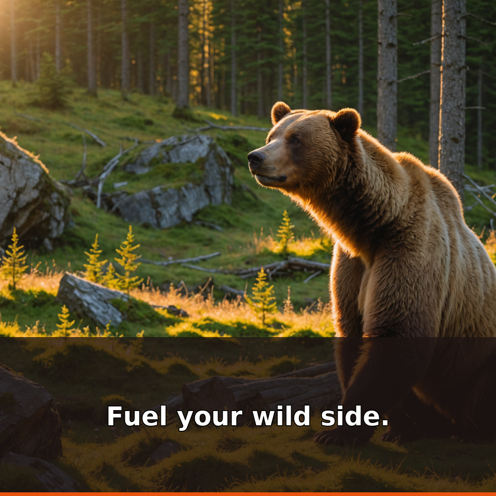
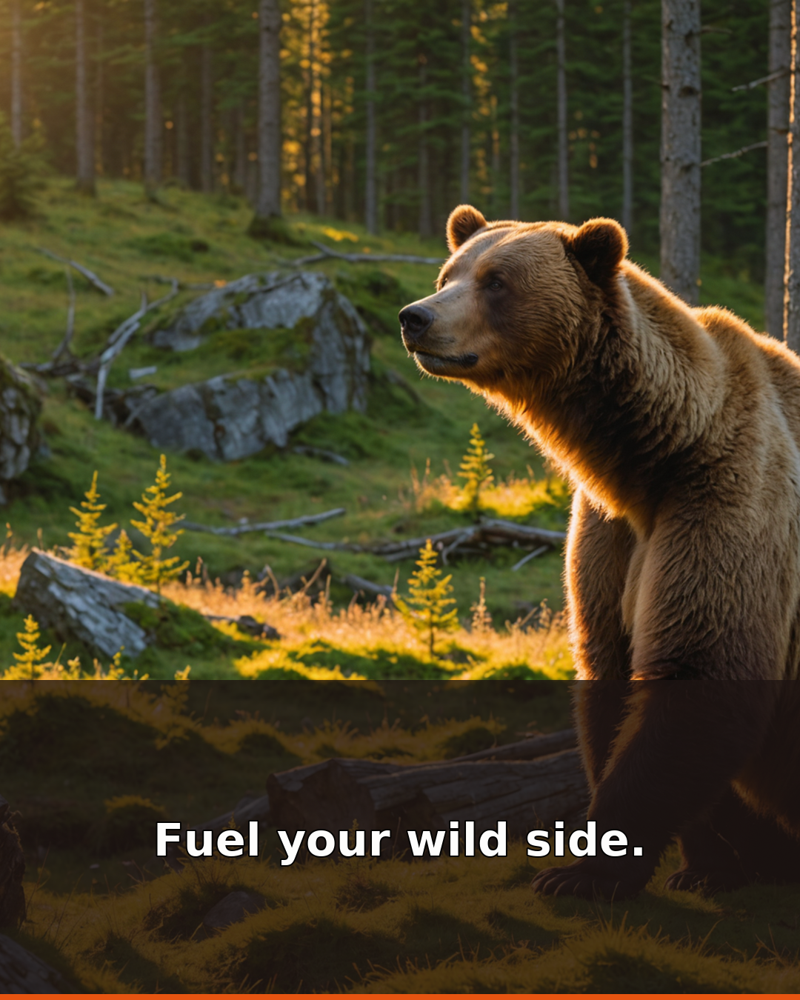
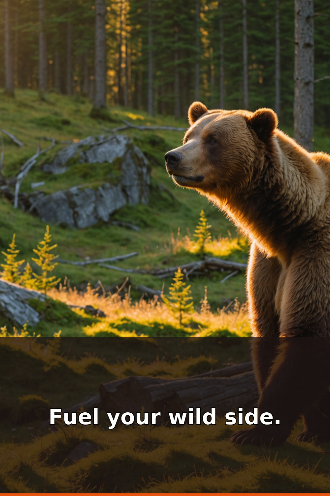

<!-- image links use raw.githubusercontent (main); for anonymous rendering switch to the CloudFront host -->

# KODIAK® — Nourishment for Today's Frontier. Feeding Epic Days & Wilder Lives.

> Since a red wagon rolled out of Park City in 1982, KODIAK® has fed the frontier — 100% whole grains, protein-packed, the bear on every box. From the Wasatch Mountains to every porch, trailhead, and town, Keep It Wild still guides every bite. One brief, one photo library, one idea sheet — hundreds of local ads that still look and feel like KODIAK®.

Every line, every photo cue, every color in here comes from Kodiak — the red wagon in 1982, the Wasatch front, 14 grams of protein and 100% whole grains, Keep It Wild with Vital Ground, and the bear that watches over breakfast. The system exists so Maya in Park City can write one line and Diego in the Southwest can share it that afternoon without waiting on an agency.

View the brand the way marketing sees it: [Human story](docs/kodiak-brand-explained.md) · [Visual page](docs/kodiak-brand-view.html) · [Who runs this — 3 quick cards](docs/ux-persona-kodiak.md) · [Every persona — 23 cards for every sprint](docs/ux-personas-kodiak-complete.md) · [Every town](docs/regional-cultural-database.md) · [Naming & brand marks](docs/iso-naming-conventions.md) · [AgentCore + RAG architecture](docs/bedrock-agentcore-architecture.md) · [Training process — Nova multimodal](docs/training-process.md) · [Technical integration — living Swagger is the product](docs/ux-personas-technical-integration.md) · [Live Swagger `GET /docs`](src/creative_automation/api.py)

More docs: [Style guide](docs/kodiak-style-guide.md) · [Use case](docs/kodiak-usecase.md) · [Newsletter breakdown](docs/newsletter-breakdown.md) · [Visual gallery](docs/visual-gallery.md) · [Target clients](docs/target-clients.md) · [Target clients — North America](docs/target-clients-na.md) · [Target clients — US local](docs/target-clients-us-local.md) · [Image standards](docs/kodiak-image-standards.md) · [Context snapshot 2026-09-03](docs/kodiak-context-2026-09-03.md)

<p align="center"><a href="https://d37333alc7ojpl.cloudfront.net"></a></p>
<p align="center"><em>Offline — all files you need are right in this folder. Open <code>web/kodiak-posts-for-todays-frontier/index.html</code> via <code>file://</code> and it still renders. No server. Hosted playground (unlisted, password <code>cakes</code>, <code>noindex</code>) at <code>https://d37333alc7ojpl.cloudfront.net</code> and <code>http://frontier-bryanchasko-com.s3-website-us-east-1.amazonaws.com</code> — <code>frontier.bryanchasko.com</code> pending cert/DNS (CNAME to CloudFront).</em></p>

---

## What it feels like to run a campaign for Kodiak

Maya opens a one-page idea sheet. Not a ticket. Just:

- **Where** — Las Cruces plus Alamogordo, New Mexico, or Publix country in Savannah, or the national on-the-go crowd of trailheads and porches
- **Who** — Park City mountain locals, Publix porch families in Savannah, Target clean-label families who flip the box for 100% whole grains, Costco bulk stock-up families, Amazon Subscribe & Save pantries, or rural cabin subscribers who need delivery — and for Las Cruces, Hatch green chile households who roast by the bushel
- **One line** — "Green chile meets grizzly — protein for your Las Cruces frontier" or "On the go never tasted so good — 5 grams for busy mornings"

She presses run. In ten minutes she has three finished ads for every product — 1:1 square for the feed, 4:5 portrait, and 2:3 tall for stories — each with the bear at 24,24, the warm orange 8-point bar at the bottom, and her line centered over the soft dark band. Green pass badges mean the bear is present and the frontier colors are right. She picks where each goes: Publix southeast, Target Midwest, Costco bulk west, that small independent in Alamogordo, or the diner. One map, one post, every town sees its own store name and its own Get Directions button.

Diego sees the Las Cruces green chile version on his phone the same morning and shares the tall story. Priya sees one master post automatically show "Find us today in {{your town}}!" to Chicago and Miami with the right map card.

That grow from one town to the next is saved — place, audience, line, photo cue — into the growing regional memory at `data/localization/` so the next Las Cruces run suggests green chile first because it already worked there.

Every town also carries the languages its neighbors actually speak. The localization program centers on the 16 primary Frontier urban markets — which line up, on purpose, with Adobe office cities — each localized in its top three most-commonly-spoken languages: English by default, then Spanish and Portuguese as the most frequent runners-up across those markets. Each urban market pairs with one sister rural frontier site, where Kodiak's Subscribe & Save home delivery carries positioning the city stores cannot match. The per-market language picks stay honest to the 2022 American Community Survey — El Paso speaks Spanish, Burlington Vermont speaks French, San Francisco speaks Spanish and Chinese — and the frontier web page shows an "EN plus the top languages for this market" chip row that changes as Maya picks a place. Under the chips the line is rewritten per language: Amazon Nova Micro carries the campaign line into each language, then a dialect swap fixes the regional variants so a French chip in Vermont says "bleuets" not "myrtilles" for blueberries, with Amazon Translate in the chain. The backend lives at `src/creative_automation/text_rewriter.py` (its `rewrite_all` returns one finished line per requested language) and the dialect fixes at `src/creative_automation/locales.py` (`resolve_dialect_terms`). The market table lives at `data/localization/market-languages.json` — 73 markets, top two each, every language entry carrying its `lang_code`, its `translate_code` (the Amazon Translate code), `pct_home` (percent who speak it at home), and a plain ACS sourcing reason. The chips show the localization coverage we plan to run — aspirational but honest, same as the rest of this page.

## Try Kodiak in 30 seconds

```bash
uv run python -m creative_automation.cli --brief briefs/kodiak.yaml --assets input_assets --out /tmp/kodiak-parks
open /tmp/kodiak-parks/preview.html
```

That is Park City, UT 84098 — Keep It Wild from the Farmers Market at the base of Park City Mountain Resort. Wednesdays 11–5, Jensen Farms peaches diced thin with cinnamon, Copper Moose rhubarb compote, Tagges preserves, Ballerina butter in Kamas. Same box, mountain summer on a griddle. Power Cakes reuses a real photo, Bear Bites and oatmeal cup are made new with the frontier palette.

**Then try the local flex you asked for — Las Cruces green chile:**

```bash
uv run python -m creative_automation.cli --brief briefs/kodiak-publix.yaml --assets input_assets --out /tmp/kodiak-publix
uv run python -m creative_automation.cli --brief briefs/kodiak-on-the-go.yaml --assets input_assets --out /tmp/kodiak-onthego
open /tmp/kodiak-on-the-go/preview.html
```

On-the-go replaces the old back-to-school idea — oatmeal cups and Bear Bites for students and commuters, "5 grams for busy mornings," from your mini bars and training guide. Always useful, not just August.

Every output is organized by product and size: `docs/assets/previews/kodiak-keepitwild-1x1.png` plus a report that members can read (`output_kodiak/report.json`, `report.jsonl` per creative per place) and a green pass board (`preview.html`).

Look inside the style library that makes this look like Kodiak everywhere:

<p align="center">
  
  
  
  
  
</p>
<p align="center"><em>Bear Brown #3B2316 · Blaze Orange #E8530E · Frontier Green #1A3C34 · Parchment #FFF8F0 · Stone #D9CFC6</em></p>

Those colors live as design tokens at `design/tokens/kodiak.json`, photo directions at `references/keep-it-wild/`, the six-piece template at `references/templates/social-3ratio.json`, and all of it mirrored to cloud storage at `s3://chasko-creative-dam-946179428633-us-east-1/brands/kodiak/`.

## The campaigns we actually plan to run — all Kodiak, all local

- **Keep It Wild** — Wasatch dawn, grizzly-safe, Vital Ground co-badge. Power Cakes hero, wilderness not candy.
- **Frontier Breakfast — retailer local** — same three flapjack, bite, and cup products but tuned per store group: Publix "for your family's frontier" (porch breakfast), Target "Fuel your frontier — 14 grams, whole grains" (clean label), Costco "Stock the frontier — every morning" (bulk family). See `briefs/kodiak-publix.yaml`, `kodiak-target.yaml`, `kodiak-costco.yaml`.
- **Seasonal: trail and holiday** — Oatmeal cup on a rocky overlook at sunrise (`kodiak-trail.yaml`), cast-iron stack for holidays (`kodiak-holiday.yaml`), both with Kodiak prompts kodiak-04/05/07.
- **On the Go** — students and commuters, 5 grams of protein that travels (`kodiak-on-the-go.yaml`).
- **Diner Flip** — local diners within 5 miles of any Kodiak store that agree to flip cakes, printable table tent and menu board from the same three sizes (`kodiak-diner.yaml`).
- **Subscribe and Save home delivery** — direct channel, 15 percent off plus free shipping over 45, "real food for real adventures" (`kodiak-subscription.yaml`).
- **Small grocers and the Alamogordo–Las Cruces cluster** — Walmart and Albertsons kodiakcakes.com/store-locator already shows plus independents added by zip, all in the same phone book at `data/localization/` and the retail network table.

See the full 18-place memory with green chile at the top: [`docs/regional-cultural-database.md`](docs/regional-cultural-database.md) — from Las Cruces to Chicago to Brooklyn.

## Channels — one creative, many doors

- Big southern supermarkets, style-forward national chain, big membership stores, small independents, local diners, direct home delivery subscription, and Amazon at https://www.amazon.com/stores/page/19CF7868-DF80-4939-932A-6FD69C6E5A1E plus https://kodiakcakes.com/collections/all (inventory copied to `references/brand-inventory.json` and cloud storage).
- Training comes from your own brand ambassador guide — video, two-page vibe sheet, feedback portal (people served, samples handed) — now tied to the same regional memory.

## How it works without the short forms

- One cloud setup holds everything — described together in `infra/template.yaml` (currently live as `chasko-creative-dam-946179428633-us-east-1` in us-east-1, versioned, private, encrypted). It keeps the style library, the regional knowledge, the store list, and the logs together. Create the phone book once in Business Locations, organize store groups, turn advantage budget off so Las Cruces stays Las Cruces, make one post and reuse it with "Use Existing Post," let dynamic text `{{store.city}}` and the map card do the local swap, button to Get Directions — full plain steps at [`docs/how-we-launch-in-every-town.md`](docs/how-we-launch-in-every-town.md).
- Style tokens live in `design/tokens/kodiak.json` and mirror to cloud. The pipeline pulls them first from cloud when `DAM_S3_BUCKET` is set, otherwise from your laptop. No hard-coded colors.
- The image engine runs three modes, and it always names which one produced a given hero. **Mode 1 — the live primary — is a genuine generative restyle seeded by a real photo.** A rights-clean Kodiak DAM lifestyle shot goes in as the seed; Amazon Nova Pro (vision, Converse, `amazon.nova-pro-v1:0`, us-east-1) reads that photo and art-directs a scene prompt for the theme; then Amazon Bedrock Stability control-structure (`us.stability.stable-image-control-structure-v1:0`, control strength 0.7) restyles the real photo so the theme lands in the pixels while the original composition is preserved. The brand's real assets go in, on-theme GenAI comes out — not text-to-image from scratch, not a flat composite. Source label: `bedrock:stability-control-structure`. On top of that render a deterministic Pillow brand overlay is composited — headline plus the Blaze Orange accent bar — and a roughly 2% kraft-paper texture is baked in so the mark and the grain are exact every time.
  - **Mode 2 — fallback.** If Stability is unavailable, the same real seed is composed by Pillow under Nova Pro's art-direction. Source label: `bedrock:nova-pro`.
  - **Mode 3 — last resort.** With no seed available at all, the engine draws a deterministic Wasatch-palette placeholder. Source label: `bedrock:nova-pro-fallback`. Missed heroes are never blank.
- Every campaign ships **three sizes**: 1:1 (1080×1080 feed), 4:5 (1080×1350 portrait), and 2:3 (1000×1500 story). Alongside each render the pipeline returns a **provenance object — a plain "How this was made" record**: the seed photo, the Nova Pro scene prompt, the engine and control strength, which ratios were produced, and whether the brand overlay and paper texture were applied. That transparency is the point — anyone can see exactly what the brand provided versus what the pipeline generated.

## How we keep building the right way

One pull request is one town or one channel. Keep it under 500 lines so Maya can read the words and the reviewer can see the three screenshots. Tests are plain: `uv run pytest -q` (now 6 checks), end to end `uv run python -m creative_automation.cli --brief briefs/kodiak-on-the-go.yaml --assets input_assets --out /tmp/verify`, visual gate `uv run python scripts/nova-act-check.py --preview /tmp/verify/preview.html`, cloud check `cfn-lint infra/template.yaml` and `aws cloudformation validate-template`. See [`CONTRIBUTING.md`](CONTRIBUTING.md) for the full flow — no hidden steps.

## For the team that wants the tech too

Photo library and style live in cloud storage mirrored to `input_assets/` and `references/`. Regional memory lives queryable in two forms that stay in sync — a simple lookup table by market (`data/localization/localization-table-seed.json`) and searchable knowledge file (`data/localization/localization-training-data.jsonl`) ready for vector search and the regional database doc. Background agents run Nova multimodal embeddings (`amazon.nova-2-multimodal-embeddings-v1:0`, 1024 dims, Titan fallback) over design tokens, pack shots, and every training row, write `data/vectors/kodiak-embeddings.jsonl`, sync to `s3://.../brands/kodiak/vectors/` (S3 Vectors, dedicated vector bucket), and are searchable via the agent-friendly API (`uv run python -m creative_automation.reference_api` → `GET /search?q=green%20chile` or MCP tool `kodiak_reference_search`) — details and runnable code at [`docs/training-process.md`](docs/training-process.md) and [`docs/bedrock-agentcore-architecture.md`](docs/bedrock-agentcore-architecture.md). Visual checks run headless across 1080 by 1080, 1080 by 1920, 1920 by 1080 and block the handoff to the store if the bear, the bar, or the legibility fails (`scripts/nova-act-check.py`, docs at [`docs/nova-act-runbook.md`](docs/nova-act-runbook.md)).

Runbooks: [AgentCore](docs/agentcore.md) · [DAM runbook](docs/dam-runbook.md) · [Observability runbook](docs/observability-runbook.md) · [Linda Film Crew pattern](docs/linda-film-crew-pattern.md)

## Strongest Examples — Real Ads, Real Frontier Flavor

Every campaign below starts from the same Kodiak look — the bear in the corner, the warm orange bar, the frontier colors — but the words and the feeling change by place and moment. Each square is the hero preview for that campaign. Open the full preview to see all three sizes and all three products.

### Real GenAI output — Stability control-structure restyle

This is Mode 1, live. A real Kodiak DAM lifestyle photo — the Apple Stack Cake shot — went in as the seed. Amazon Nova Pro art-directed the scene ("Forest clearing with Kodiak bear cub, golden hour light, earthy tones, wild adventure mood"). Amazon Bedrock Stability control-structure (control strength 0.7) restyled the real photo to the theme, then the deterministic brand overlay — headline **"Fuel your wild side."** and the Blaze Orange bar — went on top with a 2% kraft-paper texture baked in. The 1:1 is the primary Stability render; the 4:5 and 2:3 extend that same seed and scene to portrait and story ratios. Nothing here is text-to-image from scratch — the brand's real photography seeds a genuine restyle, and the provenance object records exactly that.

<p align="center">
  
  
  
</p>
<p align="center"><em>Real Stability control-structure restyle of a real Kodiak DAM photo — seed: Kodiak Apple Stack Cake lifestyle shot · Nova Pro scene direction "Forest clearing with Kodiak bear cub, golden hour light…" · headline "Fuel your wild side." · all three ratios (1:1, 4:5, 2:3) · brand overlay + 2% kraft texture applied. Full record in <code>docs/assets/previews/genai-2026-09/bears-provenance.json</code>.</em></p>

The campaign heroes below are the earlier Pillow composites — still true to the brand look, and useful for the per-town narrative — but the Stability restyle above is the real generative output. Lead with the bears.

### 1. Keep It Wild — Frontier Breakfast

_Mornings on the Wasatch front — protein-packed whole grains for today's frontier._

The original. Park City at dawn, built for active families who want a hearty start before the trail. This is the cleanest expression of the brand: wilderness, whole grains, and the bear watching over breakfast.


[Open full preview — all sizes and products](docs/assets/previews/kodiak/preview.html)

### 2. Frontier Breakfast — Publix Southeast Family

_Protein-packed whole grains for your family's frontier — the porch breakfast for Savannah and the Southeast._

Warm light, family table, kids and cubs together. Same flapjacks and bites, but the message leans into home and togetherness for Publix neighborhoods.


[Open full preview — all sizes and products](docs/assets/previews/kodiak-publix/preview.html)

### 3. Frontier Breakfast — Target Midwest

_Fuel your frontier — 14 grams of protein, 100 percent whole grains._

Clean, bright, and label-forward for Target guests who flip the box for 100% whole grains. Built for Target clean-label families who care what is inside as much as how it tastes — Feeding Epic Days & Wilder Lives.


[Open full preview — all sizes and products](docs/assets/previews/kodiak-target/preview.html)

### 4. Frontier Breakfast — Costco Bulk Family

_Stock the frontier — protein-packed whole grains for every morning._

Big family, big pantry, big stack. The Costco take is generous and weekend-ready — enough Power Cakes for the whole house, all week long.


[Open full preview — all sizes and products](docs/assets/previews/kodiak-costco/preview.html)

### 5. On the Go — Students and Commuters

_On the go never tasted so good — 5 grams of protein for busy mornings._

For backpacks, bus rides, and early classes. Oatmeal cups and Bear Bites that travel as well as you do — quick, warm, and ready before the day gets busy.


[Open full preview — all sizes and products](docs/assets/previews/kodiak-on-the-go/preview.html)

### 6. Trail Season — Oatmeal on the Overlook

_Fuel your trail — protein oatmeal for today's frontier._

Sunrise over red rock, oatmeal cup on the edge of the overlook. Made for hikers, campers, and anyone who eats breakfast with a view.


[Open full preview — all sizes and products](docs/assets/previews/kodiak-trail/preview.html)

### 7. Holiday Frontier — Cast-Iron Mornings

_Gather round the frontier — cast-iron Power Cakes for holiday mornings._

The cabin table at the holidays. Cast iron, warm cabin light, and a stack worth gathering for — cozy, timeless, and made to share.


[Open full preview — all sizes and products](docs/assets/previews/kodiak-holiday/preview.html)

---

Questions — open an issue with place, store group, and the line you want to try.
