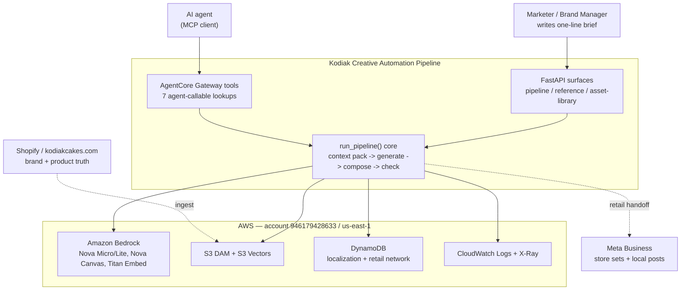
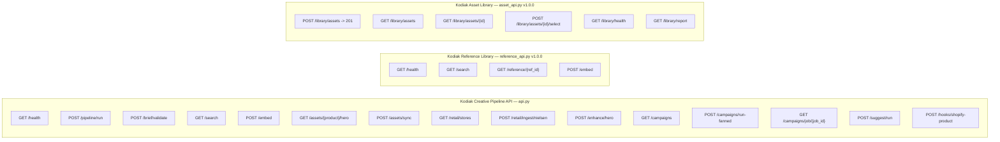
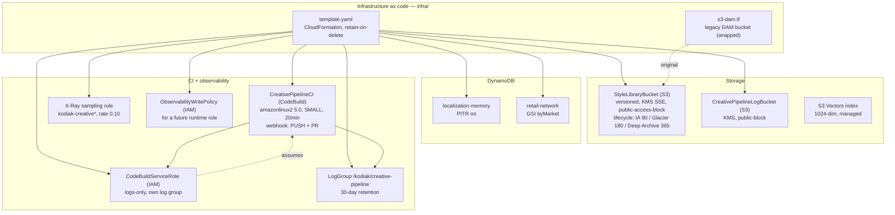
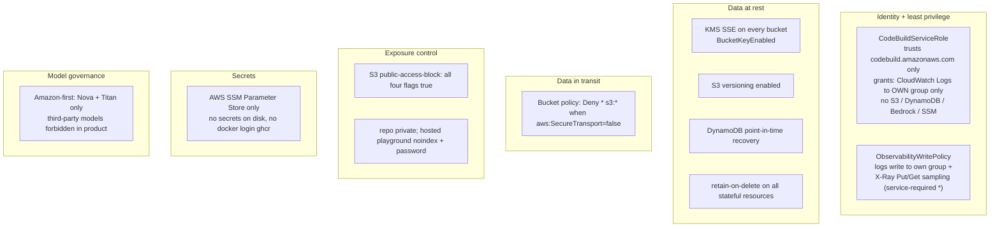
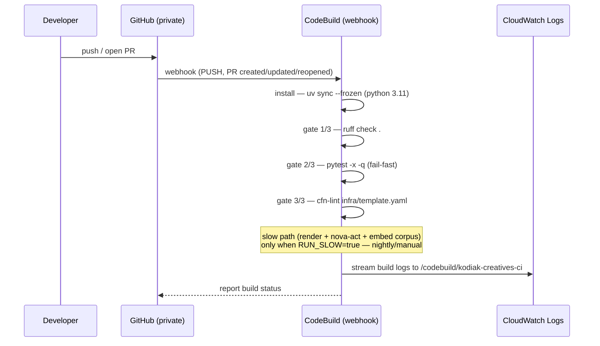

# System Overview — Kodiak Creative Automation Pipeline

> CIO-level explainer for the whole system: what it does, how it is built, where the data lives, how it is secured, and how it ships. One page to open first — every claim here is drawn from the code and infrastructure-as-code on `main`, not from intent. Deeper docs are linked at each section. Amazon-first: the product uses only Amazon models (Nova family for text and image, Titan Embed for vectors) — no third-party models.

Audience: an executive or architect who needs the full picture in one read. For the literal parts — actual button IDs, token hex values, endpoint signatures, and live AWS resource identifiers with console deep-links — see the companion [LITERAL-INVENTORY.md](LITERAL-INVENTORY.md). Rendered diagram images live under `docs/architecture/assets/`.

- Account: `946179428633` (bryanchasko-kiro), region `us-east-1`
- Repo: `chasko-labs/creative-automation-pipeline` (private)
- CI: AWS CodeBuild only (no GitHub Actions)
- Live bucket: `s3://chasko-creative-dam-946179428633-us-east-1/brands/kodiak/`

### Rendered diagram previews

For viewers that do not render mermaid, pre-rendered PNGs of every diagram in this doc live in [`assets/`](assets/). They were produced by rendering the mermaid source in this file through mermaid.js in headless chromium — the same source that renders inline below, so the images cannot drift from the text.

| #   | diagram                     | image                                                            |
| --- | --------------------------- | ---------------------------------------------------------------- |
| 2   | system context              | [assets/01-system-context.png](assets/01-system-context.png)     |
| 4   | API surface                 | [assets/02-api-surface.png](assets/02-api-surface.png)           |
| 5   | data + schema (ER)          | [assets/03-data-schema-er.png](assets/03-data-schema-er.png)     |
| 6   | infrastructure + deployment | [assets/04-infra-deploy.png](assets/04-infra-deploy.png)         |
| 7   | security posture            | [assets/05-security-posture.png](assets/05-security-posture.png) |
| 8   | CI/CD flow                  | [assets/06-cicd-flow.png](assets/06-cicd-flow.png)               |

---

## 1. What the system is — one paragraph

One brief, one photo library, hundreds of local ads that still look like the brand. A marketer writes a one-line brief (place plus audience plus one line). The system assembles a retrieval-augmented context pack from what already worked in that market, asks Amazon Nova to rewrite copy and generate imagery, composes the final creative deterministically from brand tokens, runs brand and legal checks, and writes finished assets in three aspect ratios per product. Everything runs locally as the always-present fallback; Amazon Bedrock AgentCore is the planned hosting wrap over the same `run_pipeline()` core.

---

## 2. Level 0 — system context

The outermost view: who touches the system and what external services it depends on.

Human view of the same idea in marketing language: [how we launch in every town](../how-we-launch-in-every-town.md).

---

## 3. RAG and the agentic core

This is the heart of the system and already has a detailed, CIO-grade diagram — see [Bedrock AgentCore Architecture](../bedrock-agentcore-architecture.md). In short: a brief plus retrieved context (localization memory, nearest visual cluster, brand rules, ingredient truth, retailer set, dialect terms) becomes a few-hundred-word context pack that goes into Nova. Retrieval is Bedrock Knowledge Base over S3 Vectors, embedding is Titan Embed Text v2:0 (1024-dim), and the compose step is deterministic Pillow code driven by brand tokens — not another model.

Retrieval and embedding facts, verified in code:

| concern         | value                                                      | source                                                    |
| --------------- | ---------------------------------------------------------- | --------------------------------------------------------- |
| embedder        | Titan Embed Text v2:0 (only embedding model)               | `bedrock-agentcore-architecture.md`, `scripts/embed-*.py` |
| embed dimension | 1024                                                       | `agentcore-backlog.md` A1, `reference_api.py`             |
| vector store    | S3 Vectors (managed, no servers)                           | `infra/template.yaml` comments, KB config                 |
| text model      | Nova Micro / Lite via Converse                             | `docs/agentcore.md` env                                   |
| image model     | Nova Canvas via InvokeModel, seed-locked                   | `bedrock-agentcore-architecture.md`                       |
| training corpus | `data/vectors/kodiak-embeddings.jsonl` (3144 real vectors) | `agentcore-backlog.md`                                    |
| sample prompts  | `data/prompts/blog-sample-prompts.jsonl` (635 prompts)     | `agentcore-backlog.md`                                    |

---

## 4. API surface

Three FastAPI applications, each graceful-degrading when FastAPI or credentials are absent (offline-first). Endpoints below are verified against `src/creative_automation/api.py`, `reference_api.py`, and `asset_api.py` on `main`.

### Agent-callable tools (AgentCore Gateway)

Seven MCP tools registered in `src/creative_automation/gateway.py`, mirrored by the manifest `.agents/mcp-kodiak-gateway.json`. Every tool composes an already-built local unit — the gateway adds no new lookup logic — and each is offline-safe (a miss returns a note, never raises). Discovery contract: `list_tools()`; invocation contract: `dispatch_tool(name, args) -> {ok, result}`.

| tool                   | composes                                 | required input                  |
| ---------------------- | ---------------------------------------- | ------------------------------- |
| `context_pack`         | `context_pack.build_context_pack`        | market or full brief            |
| `retailer_lookup`      | `retailers.resolve_retailer`             | name (costco / publix / target) |
| `dam_hero_lookup`      | `dam.find_hero_asset`                    | product                         |
| `asset_library_browse` | `asset_library.AssetLibrary.list_assets` | (optional kind filter)          |
| `recipe_card_plan`     | `recipe_card.build_recipe_card`          | market                          |
| `monthly_ingredient`   | `locales.resolve_this_month`             | market                          |
| `run_campaign_tool`    | `runtime.handle_campaign_request`        | brief                           |

---

## 5. Data and schema

Two DynamoDB tables plus the S3 Vectors index plus the DAM object store. Key schemas below are verified against `infra/template.yaml`.

```mermaid
erDiagram
    LOCALIZATION_MEMORY {
        string market PK "partition key"
        string place_message_id UK "sort key"
        string audience
        string message
        string photo_cue
        string zip
    }
    RETAIL_NETWORK {
        string store_id PK "partition key"
        string market UK "GSI byMarket"
        string street
        string city
        string zip
        string store_set
    }
    ASSET_REF {
        string asset_id PK "ulid not filename"
        string kind "raster vector doc copy"
        string filename
        string s3_uri
        string s3_key
        string content_type
        int size_bytes
        string sha256 "dedup and integrity"
        string added_at "ISO 8601 UTC"
        string added_by
        string source "upload pipeline import"
    }
    VECTOR_RECORD {
        string id PK
        string type "text image multimodal"
        float embedding "1024 dim Titan v2"
        string market
        string retailer
    }

    RETAIL_NETWORK ||--o{ LOCALIZATION_MEMORY : "market clusters"
    LOCALIZATION_MEMORY ||--o{ VECTOR_RECORD : "retrieved by market"
    ASSET_REF ||--o{ VECTOR_RECORD : "embedded on ingest"
```

Storage facts:

- DynamoDB `kodiak-creatives-localization-memory` — PK `market`, SK `place_message_id`, PAY_PER_REQUEST, point-in-time recovery on, retain-on-delete
- DynamoDB `kodiak-creatives-retail-network` — PK `store_id`, GSI `byMarket` (all attributes projected), PAY_PER_REQUEST, retain-on-delete
- S3 Vectors — managed vector store behind the Bedrock Knowledge Base, 1024-dim
- DAM object layout — `brands/kodiak/library/<asset_id>/<filename>` plus an `asset.json` metadata sidecar; distinct from `renders/` (pipeline output) and `references/` (training corpus)
- `AssetRef` is the seam contract between the asset-library service, the pipeline, and the frontend. Adding an optional field is safe; renaming or removing one is a seam event — see [asset library + observability design](asset-library-and-observability.md)

`AssetRef` dedup by `sha256` means the same file added twice returns the first ref, no duplicate object. `asset_id` is a ULID so records sort by time and never collide on filename.

---

## 6. Infrastructure and deployment

One CloudFormation template (`infra/template.yaml`) provisions the whole cloud footprint. The legacy Terraform file (`infra/s3-dam.tf`) created the original DAM bucket; the template now wraps that footprint. All stateful resources carry `DeletionPolicy: Retain` and `UpdateReplacePolicy: Retain`.

Deployment surfaces:

- Local (live today): `uv run python -m creative_automation.cli --brief briefs/kodiak.yaml --assets input_assets --out output_kodiak`
- Cloud DAM mirror: `scripts/sync-dam.sh` to `brands/kodiak/` — see [DAM runbook](../dam-runbook.md)
- Planned: wrap `run_pipeline()` as a Bedrock AgentCore Runtime — see [AgentCore promotion path](../agentcore.md). The `ObservabilityWritePolicy` exists now for that future runtime role to attach; the runtime role itself is not defined in the template yet.

---

## 7. Security posture

Consolidated view of controls that exist in the infrastructure-as-code today. No control claimed here is aspirational — each maps to a resource in `infra/template.yaml`.

Security facts, each verifiable:

| control                   | mechanism                                             | resource                                          |
| ------------------------- | ----------------------------------------------------- | ------------------------------------------------- |
| encryption at rest        | KMS SSE with bucket keys                              | `StyleLibraryBucket`, `CreativePipelineLogBucket` |
| encryption in transit     | TLS-only bucket policy (deny non-TLS)                 | `StyleLibraryBucketPolicyTLSOnly`                 |
| public exposure           | public-access-block, all four flags true              | both S3 buckets                                   |
| least privilege (CI)      | CodeBuild role writes only to its own log group       | `CodeBuildServiceRole`                            |
| least privilege (runtime) | scoped log + X-Ray write policy, no data-plane grants | `ObservabilityWritePolicy`                        |
| data durability           | versioning + PITR + retain-on-delete                  | buckets + tables                                  |
| secrets                   | SSM Parameter Store only, nothing on disk             | operating standard                                |
| model governance          | Amazon-first, no third-party models in product        | `dispatch-guideline.md`                           |

Note on the X-Ray `Resource: "*"` in `ObservabilityWritePolicy`: AWS does not support resource-level scoping for `xray:PutTraceSegments`, `PutTelemetryRecords`, or the sampling reads. The wildcard is an AWS service constraint, not a widening of scope — the policy grants no data-plane access to S3, DynamoDB, or Bedrock.

---

## 8. CI/CD flow

Fail-fast gate ordered cheapest-to-most-expensive so a broken push dies in seconds. Verified against `buildspec.yml` and the `CreativePipelineCI` CodeBuild project. GitHub Actions is not used; CodeBuild is the only sanctioned CI.

The per-push gate pins `RUN_SLOW=false` so the expensive path (Nova image render, Nova Act browser check, the full embedding run, cloud e2e sync) never runs on a normal push — it belongs to nightly or manual runs. The build follows harness-first CI: install plus gate commands only, no inline service configuration.

---

## 9. Directory map and team ownership

Path-by-path ownership is defined in [team lanes](team-lanes.md); dispatch rules and tooling standards in [dispatch guideline](dispatch-guideline.md). Summary of the three lanes:

| team          | owns                                                                          | drives                                          |
| ------------- | ----------------------------------------------------------------------------- | ----------------------------------------------- |
| team-pipeline | engine `src/creative_automation/*.py`, AgentCore design, `rust/kodiak-local/` | one brief becomes hundreds of on-brand assets   |
| team-frontend | `web/`, design tokens, render templates, brand + UX docs                      | how a marketer picks a prompt and sees a result |
| team-platform | `infra/`, `buildspec.yml`, DAM + ops scripts, runbooks                        | how it deploys and stays healthy                |

The seams — shared contracts where lanes touch — are design tokens (`design/tokens/kodiak.json`), API response shapes, the sample-prompt JSONL schema, the ISO naming regex (`naming.py`, single source of truth), and the DAM bucket layout. Changing either side of a seam without the other is how one team breaks another; every seam has a named contract owner.

---

## 10. Live today vs planned

The maturity view a CIO wants up front. The local pipeline is the always-present fallback at every step — AgentCore wraps it, never replaces it.

| capability                                                    | status                | evidence                                                         |
| ------------------------------------------------------------- | --------------------- | ---------------------------------------------------------------- |
| local `run_pipeline()` end to end                             | live                  | `tests/test_e2e.py`, README quickstart                           |
| DAM on S3, KMS, versioned                                     | live                  | `s3://chasko-creative-dam-946179428633-us-east-1/brands/kodiak/` |
| CloudFormation footprint (buckets, tables, CI, observability) | live                  | `infra/template.yaml`                                            |
| CodeBuild CI gate                                             | live                  | `buildspec.yml`, `CreativePipelineCI`                            |
| 7 AgentCore Gateway tools                                     | live (local dispatch) | `gateway.py`, PR #13                                             |
| asset-library write path + observability substrate            | live                  | `asset_api.py`, `observability.py`, PR #10/#12                   |
| RAG corpus (3144 vectors, 635 prompts)                        | live                  | `data/vectors/`, `data/prompts/`                                 |
| AgentCore Runtime hosting wrap                                | planned               | `agentcore.md`, `agentcore-backlog.md` epic C                    |
| AgentCore Memory (cross-session market wins)                  | planned               | backlog C3                                                       |
| Nova Act visual QA in the loop                                | planned               | `nova-act-runbook.md`, backlog                                   |
| runtime IAM role (attaches ObservabilityWritePolicy)          | planned               | template comment                                                 |

---

## Related documents

- [Bedrock AgentCore Architecture](../bedrock-agentcore-architecture.md) — the RAG + agentic core, full data-flow diagram
- [AgentCore promotion path](../agentcore.md) — local POC to Bedrock runtime
- [AgentCore backlog](agentcore-backlog.md) — decomposed, dependency-ordered units
- [Asset library + observability design](asset-library-and-observability.md) — AssetRef contract, Observer substrate
- [Team lanes](team-lanes.md) — path ownership and seams
- [Dispatch guideline](dispatch-guideline.md) — agent roster, tooling standards, CI gate
- [DAM runbook](../dam-runbook.md) · [Nova Act runbook](../nova-act-runbook.md) · [Observability runbook](../observability-runbook.md)
- [ISO naming conventions](../iso-naming-conventions.md) · [Kodiak image standards](../kodiak-image-standards.md)
