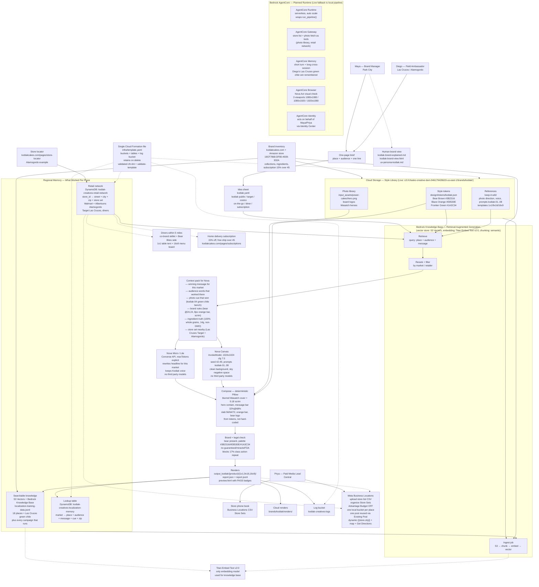

# Bedrock AgentCore Architecture — Kodiak Frontier Creative System (Planned and Live)

> One cloud setup, hundreds of local ads. A lot of context goes into every Nova call — we never use third party models, only Amazon models (Nova family, Titan Embed).

## How the ton of context around Nova actually works — in plain words

Marketing writes one line like "Green chile meets grizzly — protein for your Las Cruces frontier." That line alone is not enough. Before the system asks Nova to do anything, it pulls a pack of what already worked in that place:

- **From the lookup table** — the last winning audience and line for market `US-SW-LASCRUCES` (green chile families 28 to 45, Hatch roast, Organ Mountains bench photo cue).
- **From searchable knowledge** — the 18 seeded places plus every campaign that has run since, found by meaning not just exact words, so "green chile families" also finds Albuquerque red chile and Hatch season.
- **From the style library** — the three frontier colors, the bear clear space and size, the scrim at 68 percent, the slab sizes per ratio, and the legal guardrail that blocks over-claiming protein.
- **From the store phone book** — the actual Target on the north side of Las Cruces and the Walmart and Albertsons in Alamogordo that the store locator already shows, plus the small independent on Main and the diner on US-70 if Maya added them.
- **From brand truth** — ingredients and subscriptions copied from kodiakcakes.com and the Amazon brand store (100 percent whole grains, protein, non genetically modified, real fruit and nuts and seeds, colors from natural sources, 15 percent off plus free shipping over 45 for home delivery).

That pack — a few hundred words, five to eight retrieved snippets — is added to the prompt that goes to Nova. Nova Micro (or Lite) rewrites the headline so it sounds like Kodiak in Las Cruces, not Kodiak in Minneapolis. Nova Canvas builds a frontier photo that leaves sky empty for the line and never puts text or a logo inside the image itself. **We never use third party models** — embedding is always Titan Embed Text v2:0, text and image generation are always Nova family models via Bedrock. The knowledge base chunking is semantic, FM-based for tables, and the vector store is S3 Vectors (managed, no servers to run).

The compose step does not use another model at all — it is deterministic code that places the hero, dims the Wasatch cover, puts the line over the dark band, adds the bear at 24,24 and the orange bar, all from tokens. That is why the same three products can make hundreds of different local ads without looking different in brand terms.

## Why this mirrors the single cloud file you asked for

`infra/template.yaml` creates the cloud storage bucket (`chasko-creative-dam-946179428633-us-east-1`, live via the earlier `s3-dam.tf` and now wrapped), the localization memory table, the retail network table (store sets + city clusters + small grocers + diners), and the log bucket — all with retain on delete, versioning, private block, and key encryption. The knowledge base itself is a Bedrock resource that points at the same bucket prefix `brands/kodiak/` where `data/localization/localization-training-data.jsonl` and `references/keep-it-wild/` already live. Tests at `tests/test_e2e.py` prove the pack goes end to end: one brief in, three sizes out, bear and palette pass, Las Cruces green chile row is found.

## Live today vs planned

- **Live today** — local pipeline via `uv run python -m creative_automation.cli --brief briefs/kodiak.yaml --assets input_assets --out output_kodiak`, style library mirrored to cloud storage at `s3://chasko-creative-dam-946179428633-us-east-1/brands/kodiak/` via `scripts/sync-dam.sh`, report and preview written locally and synced to `brands/kodiak/renders/`.
- **Planned on top of live** — wrap `run_pipeline()` as an AgentCore Runtime, expose photo fetch and store lookup as Gateway tools, give it Memory so Diego's Las Cruces green chile win is remembered cross-session, let Browser via Nova Act open `preview.html` at the three viewports and block the retail handoff if the bear or bar fails. The diagram above shows the planned blocks in the same place as the live ones — no second account, no hidden stack.

